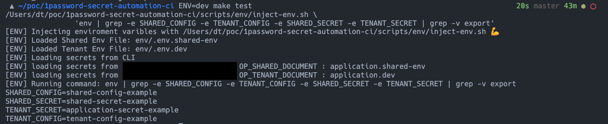
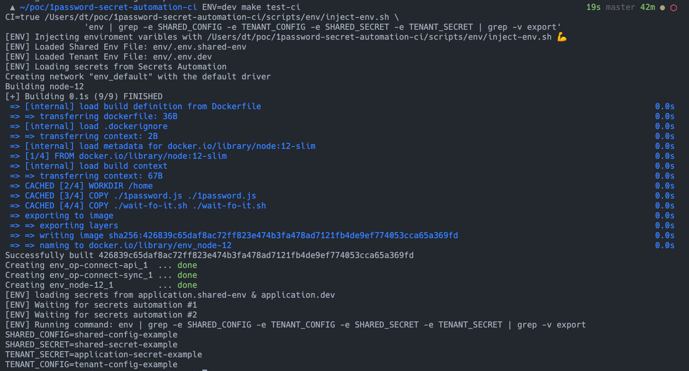
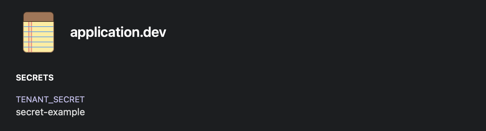

# Local OP CLI and CI OP Secret Automation Setup

- Single entry point for both tools
- Run secret automation in CI without hosting an external server
- Multi environment and multi tenanted approach to configuration
- Secrets loaded and command executed from sub shell
- Human credentials used in local, machine token in CI

## Usage

### Local (CLI)
```
ENV=dev make test
```


### CI (Secret Automation)
```
ENV=dev make test-ci
```


## Setup

### Secret Setup

```
1. Create vault in OP and define OP_VAULT in env/.env.shared-env
2. Create secrets document in OP named application.shared-env and application.dev
3. Add section called "Secrets" to documents
4. Add secrets to newly created sections
```



Add vault id to `env/.env.shared-env`

###  Local
```bash
brew install --cask 1password-cli
op signin <Your Domain>.1password.com <Your Account>
// *Secret Key can be found : 1password7 app > preferences > accounts
```

### CI
Follow steps https://support.1password.com/secrets-automation/

```bash
//Store secrets in CI
OP_TOKEN=<Machine user access token>
OP_AUTOMATION_CREDENTIALS=<Base64 encoded 1password-credentials.json >
```